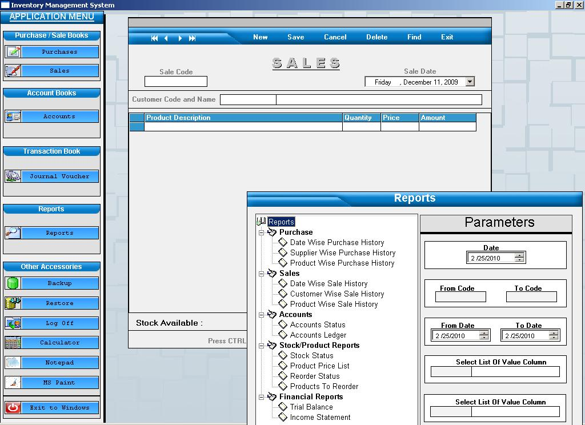



## Inventory Management System

### Description

Dear fellows, this is an Inventory Management System with Access Database on backend. It has been developed on 4 Input forms i.e Accounts, Purchases, Sales and Transactions and many reports i.e Purchase Reports (Date Wise / Supplier Wise / Product Wise), Sales Reports (Date Wise / Customer Wise / Product Wise), Accounts Reports (Accounts Status / Accounts Ledger), Stock Reports (Stock Status / Price List / Reorder Level / Product to Reorder), Financial Reports (Trial Balance / Income Statement) . No Data Environment used for reporting. Not 3rd Party control used. There should be some bugs in it as I am not so expert in Coding. If you face any error/bug please try to resolve it and also inform me on my email address hafizm.farooq@hotmail.com. Also mention the bug/Fixes in Comments so everybody can check and fix it. Do not delete Values from Table ACCOUNT_HEADS and first column Value of Table MAX_CODES. If you like this project, please Vote for me.
 
### More Info
 

             |
---                |---
**Submitted On**   |2010-02-10 12:24:50
**By**             |[M\.Farooq](https://github.com/Planet-Source-Code/PSCIndex/blob/master/ByAuthor/m-farooq.md)
**Level**          |Intermediate
**User Rating**    |4.6 (32 globes from 7 users)
**Compatibility**  |VB 6\.0
**Category**       |[Complete Applications](https://github.com/Planet-Source-Code/PSCIndex/blob/master/ByCategory/complete-applications__1-27.md)
**World**          |[Visual Basic](https://github.com/Planet-Source-Code/PSCIndex/blob/master/ByWorld/visual-basic.md)
**Archive File**   |[Inventory\_2175622252010\.zip](https://github.com/Planet-Source-Code/m-farooq-inventory-management-system__1-72908/archive/master.zip)

